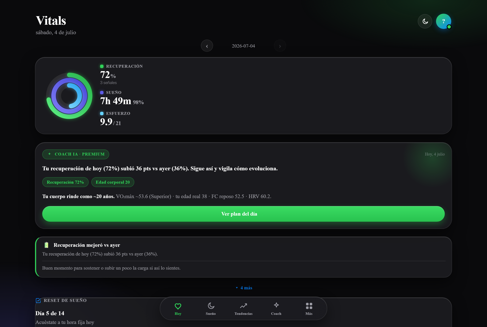
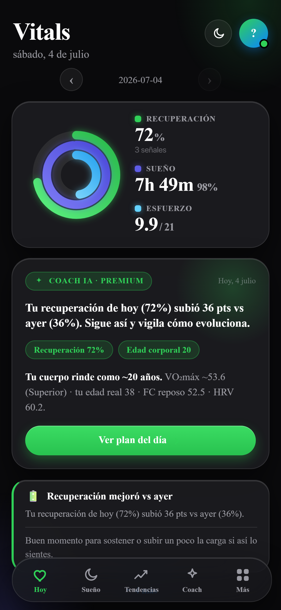
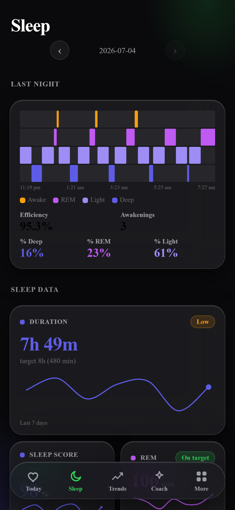
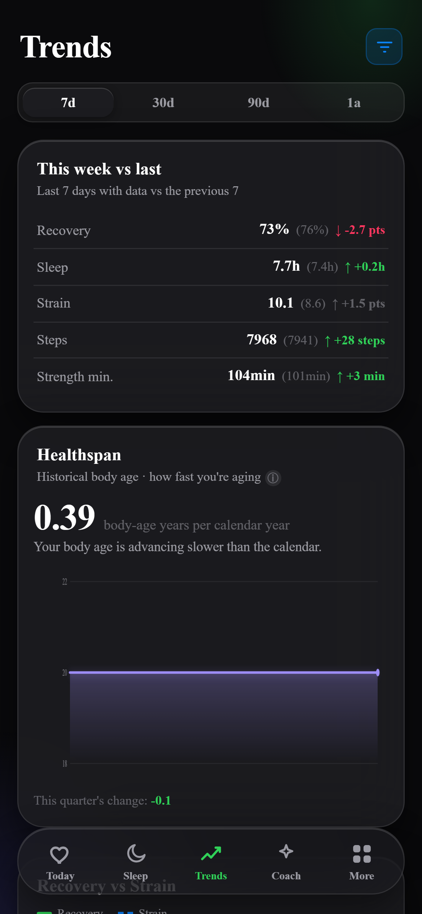
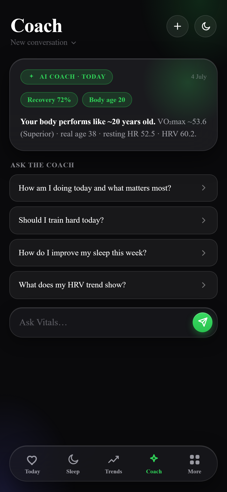

# Vitals — self-hosted WHOOP / Google Health alternative

[](https://github.com/DocStream-Oficial/vitals-app/actions/workflows/ci.yml)
[](LICENSE)
[](https://www.python.org/)
[](#tests)

**Your data. Your server. Your AI.**

A personal recovery / strain / sleep / body-age dashboard — the kind of thing you'd
pay a monthly subscription for — except it runs on hardware you own, reads from
wearables you already have (Google Fit, Oura, WHOOP, Apple HealthKit), and never
sends a byte of your health data to a third-party cloud.

<p align="center">
  
  
</p>
<p align="center">
  
  
  
</p>
<p align="center"><sub>Sleep stages &amp; hypnogram · week-over-week trends &amp; healthspan pace · conversational AI coach.<br>All screenshots from demo mode (<code>VITALS_DEMO=1</code>) — 100% synthetic data, no real user involved.</sub></p>

---

## Why Vitals

Wearable dashboards (WHOOP, Oura, Fitbit Premium) are subscription products: your
recovery, sleep, and HRV history live on someone else's server, gated behind a
monthly fee, and the scoring logic is a black box.

Vitals takes the opposite bet:

- **Self-hosted, always** — Docker Compose or a plain Python venv on a box you
  control (a spare Mac mini, a home server, a $5 VPS). No subscription, ever.
- **Bring your own OAuth** — you create your own Google/Oura/WHOOP developer
  credentials; Vitals never proxies your data through a shared backend.
- **Transparent scoring** — recovery, strain, sleep performance, and body-age are
  plain Python you can read in an afternoon. See [`docs/ALGORITHMS.md`](docs/ALGORITHMS.md)
  for the exact formulas, weights, and — just as important — their honest limitations.
- **AI-native, via MCP** — `vitals_mcp.py` exposes your health data as 9 MCP
  tools, so a local AI agent ([OpenClaw](https://openclaw.io),
  [Hermes](https://hermes-agent.nousresearch.com), Claude, or anything speaking
  MCP) can reason over your recovery trend, flag an early illness signal, or
  answer "should I train hard today?" without any of that data leaving your
  network. There's even a [copy-paste prompt](#zero-effort-setup-just-ask-your-agent)
  your agent can run to wire itself up.
- **Multi-source, source-agnostic** — connect Google Health, Oura, WHOOP, or
  Apple HealthKit (or several at once); the scoring engine normalizes whatever
  comes in to one internal schema.

If you've ever wanted your quantified-self data to actually be *yours* — inspectable,
exportable, and running on infrastructure you control — this is that.

---

## Features

| Area | What it does |
|---|---|
| **Today** | Recovery ring (HRV/RHR/sleep composite), strain, sleep breakdown, HRV/RHR vs. rolling baseline |
| **Trends** | 7d/30d rolling views of recovery, HRV, sleep, training load (ACWR) |
| **Coach** | Conversational AI coach (multi-conversation, ChatGPT/Claude-style) via your local `claude` CLI — no API key needed if you already run OpenClaw |
| **Journal + Behavior Impact** | Daily habit tracker (~33 habits: supplements, alcohol, meditation, screens-in-bed, etc.) + a statistical engine that finds which habits *actually* move your recovery/HRV/sleep — Spearman correlation with Benjamini-Hochberg correction, not vibes |
| **Narrative reports** | Weekly/monthly plain-language summaries of what changed and why |
| **Labs** | Manual blood-test tracking (~20 common biomarkers) with reference ranges and out-of-range flags |
| **Body-age & Healthspan** | VO2max-based fitness age (NTNU/Nes 2011 formula) plus a monthly body-age-vs-chronological-age trend |
| **Household / multi-profile** | Track multiple people (family, partner) from one instance, each with isolated data |
| **Push notifications** | ntfy/Telegram alerts for recovery drops, illness-risk signals, sleep debt |
| **Offline-capable PWA** | Add to Home Screen on iOS/Android; service worker caches the shell |
| **Native iOS app (BYO dev account)** | Capacitor shell with a native HealthKit plugin: Apple Watch HRV, sleep stages, VO₂max, ECG — built and signed by you, distributed via TestFlight |
| **AI agent integration (MCP)** | 9 read-only MCP tools for OpenClaw / Hermes / Claude — morning briefs, bedtime reminders, proactive alerts from your own agent |
| **Female health module** | Opt-in cycle tracking (phase, fertile window, delay detection, peri/menopause signals) — zero data exposure unless explicitly enabled |
| **ECG viewer** | Isolated viewer for Apple Watch ECG waveforms pushed from the iOS companion app |
| **Data export** | Full JSON or flattened CSV export of your own history, any time |

---

## Supported data sources

| Source | Auth | Notes |
|---|---|---|
| **Google Fit / Health Connect** | OAuth 2.0 (BYO client) | Fitbit, Pixel Watch, Garmin, and anything synced into Google Health Connect |
| **Oura** | OAuth 2.0 (BYO client) | Oura Ring v2 API |
| **WHOOP** | OAuth 2.0 (BYO client) | WHOOP v2 API — requires `offline` scope for refresh tokens |
| **Apple HealthKit** | Push token (`INGEST_TOKEN`) | Companion iOS app reads HealthKit on-device and pushes to `/api/ingest` — no cloud round-trip |

You can connect more than one source at once; the sync engine merges them into a
single daily record per metric.

---

## Quick start

### Docker (recommended)

No Python setup, no venv — just Docker.

```bash
git clone https://github.com/DocStream-Oficial/vitals-app.git
cd vitals-app
cp .env.example .env        # fill in your credentials (see below), or skip for demo mode
docker compose up -d
# open http://localhost:8700
```

Want to try it before connecting any real credentials? Run it in **demo mode**
instead — a deterministic synthetic dataset (150 days of realistic
recovery/sleep/HRV/strain, plus sample journal entries and lab results) with
no OAuth, no `.env`, no wearable required:

```bash
docker compose run --rm -e VITALS_DEMO=1 -p 8700:8700 vitals
# open http://localhost:8700 — fully populated dashboard, no login
```

In demo mode, every write-y endpoint (sync, OAuth login, source connect/disconnect,
HealthKit ingest) responds `200 {"status": "demo"}` instead of touching real
credentials or `data/`. Journal/labs entries you add in demo mode go to a
throwaway temp directory that's discarded when the process exits — nothing you
do in demo mode can affect a real install running alongside it.

### No Docker — one command (`install.py`)

Prefer a plain Python venv over Docker? `install.py` is a single cross-platform
script (Windows/Mac/Linux, stdlib only) that creates the venv, installs
dependencies, generates `.env`, and launches the app — no manual steps.

```bash
git clone https://github.com/DocStream-Oficial/vitals-app.git
cd vitals-app
python install.py
# open http://localhost:8700
```

It's idempotent — re-run it any time; it reuses an existing `.venv` and never
overwrites an existing `.env`. Try demo mode the same way, with zero credentials:

```bash
python install.py --demo
```

#### Flags

| Flag | What it does |
|---|---|
| *(none)* | Interactive wizard (all fields optional, Enter = default/skip), then launches the app |
| `--demo` | Sets `VITALS_DEMO=1`, skips all credential prompts, launches straight into the demo dataset |
| `--no-launch` | Only does setup (venv + deps + `.env`); prints how to start the app manually, doesn't launch it |
| `-y`, `--yes` | Non-interactive: copies `.env.example` as-is (auto-generating `INGEST_TOKEN`), no prompts — for CI/scripts |
| `--port N` | Port for uvicorn (default `8700`) |
| `--help` | Full usage |

`install.py` requires Python 3.9+ (same minimum as the rest of the project) and
uses whichever interpreter you invoked it with (`python`, `python3`, or `py -3`
on Windows) to create the venv — no need to guess the right command for your
platform.

### Manual setup (venv, no installer)

If you'd rather run the steps yourself:

```bash
git clone https://github.com/DocStream-Oficial/vitals-app.git
cd vitals-app
python3 -m venv .venv && source .venv/bin/activate   # Windows: .venv\Scripts\activate
pip install -r requirements.txt
cp .env.example .env        # fill in your credentials (see below)
uvicorn main:app --host 127.0.0.1 --port 8700 --reload
# open http://localhost:8700
```

### Windows service (NSSM)

For a persistent background service (not just a dev session), see
`deploy_windows.ps1` for a step-by-step PowerShell script.
Requires Python 3.9+, NSSM, and Tailscale (for remote HTTPS access).

---

## Setting up Google OAuth (BYO credentials)

Vitals uses Google's OAuth 2.0 to read your health data.
**Each person creates their own OAuth client** — there is no shared client ID.

1. Go to [Google Cloud Console](https://console.cloud.google.com/) → **APIs & Services → Credentials**.
2. Create a project (or use an existing one).
3. Enable **Fitness API** and/or **Health Connect API**.
4. Create an **OAuth 2.0 Client ID** (type: *Web application*).
5. Add `http://localhost:8700/auth/callback` as an authorized redirect URI.
   - For remote access add `https://your-box.your-tailnet.ts.net/auth/callback`.
6. Copy `CLIENT_ID` and `CLIENT_SECRET` into your `.env`.

> **Testing mode:** while your OAuth app is in *Testing* status, tokens expire every 7 days.
> The dashboard shows a "Reconnect" banner when that happens — tap it to re-auth in one click.
> Publish the app (Google verification is optional for personal use) to get a permanent refresh token.

Oura and WHOOP work the same way — create a developer app on their respective
portals and drop the client ID/secret into `.env` (see `.env.example` for the
exact keys). Apple HealthKit doesn't use OAuth; see `docs/IOS-HEALTHKIT.md`.

---

## Configuration (`.env`)

```bash
cp .env.example .env
```

See [`.env.example`](.env.example) for the full list of variables with inline
comments (OAuth credentials per source, profile defaults, `INGEST_TOKEN`,
notification settings, Claude CLI path, and `VITALS_DEMO`).

### Coach with a local LLM (Ollama, LM Studio, llama.cpp)

By default the Coach (chat, headline, and narrative reports) shells out to
your local `claude` CLI — no API key needed. If you'd rather run everything
fully offline against a self-hosted model, set `COACH_BACKEND=openai_compat`
in `.env` and point it at any OpenAI-compatible `/chat/completions` endpoint:

```bash
# .env
COACH_BACKEND=openai_compat
COACH_API_BASE=http://localhost:11434/v1   # Ollama default
COACH_MODEL=llama3.1                        # must already be pulled/loaded
COACH_API_KEY=                              # leave empty for local servers
```

This works with [Ollama](https://ollama.com) (`ollama pull llama3.1` first),
[LM Studio](https://lmstudio.ai)'s local server, or any `llama.cpp`-based
server that speaks the OpenAI chat-completions format. The request is a
single stdlib `urllib` POST (no new pip dependency, no SDK) — same
best-effort semantics as the CLI: a slow/unreachable server times out and
falls back gracefully, it never blocks a request or crashes the app.
`COACH_BACKEND` unset (or any unrecognized value) keeps the default
`claude_cli` behavior — nothing changes if you don't touch this.

### Dashboard login (`DASHBOARD_TOKEN`)

By default, anyone who can reach the app's port can view your dashboard — no
login screen. Set `DASHBOARD_TOKEN` in `.env` to require authentication:

```bash
# .env
DASHBOARD_TOKEN=$(python3 -c "import secrets; print(secrets.token_urlsafe(32))")
```

Then log in once at `/login` (sets a long-lived cookie), or send
`Authorization: Bearer <DASHBOARD_TOKEN>` on every request (handy for `curl`
or Grafana). `/api/ingest` + `/api/ecg` (the iOS app's own push endpoints) and
`/api/v1/*` (the public read-only API) keep their own independent auth either
way — this only gates the dashboard itself. Full details, including the CSRF
side-benefit, in `SECURITY.md`.

---

## Architecture / Tech stack

- **Backend**: FastAPI (Python 3.9+), vanilla JS frontend (no build step), served
  as a single process — `uvicorn main:app`.
- **Persistence**: flat JSON files under `data/` (no database). Atomic writes
  (`.tmp` + `os.replace`) everywhere; each domain (profile, journal, labs, cycle,
  coach history) has its own file. Household/multi-profile mode namespaces these
  under `data/users/<uid>/`.
  See [`docs/ALGORITHMS.md`](docs/ALGORITHMS.md) for how the raw per-source
  payloads get normalized into the daily schema.
- **Scheduler**: APScheduler background job for the daily sync (`SYNC_HOUR` in
  `.env`), plus a best-effort sync on boot.
  See [`docs/ALGORITHMS.md`](docs/ALGORITHMS.md) for the scoring pipeline that
  runs on every sync (recovery, strain, sleep performance, body-age).
- **AI coach**: shells out to your local `claude` CLI (no API key required if
  you already run [OpenClaw](https://openclaw.io)); degrades gracefully to a
  deterministic fallback narrative if the CLI isn't available.
- **MCP server**: `vitals_mcp.py` (separate process, Python 3.10+/`mcp` SDK)
  exposes your data as MCP tools for any MCP-speaking agent.
- **Mobile**: Capacitor-wrapped iOS app (`ios/`) for native HealthKit/ECG access,
  talking to the same FastAPI backend over `/api/ingest`.
- **Interactive API docs**: FastAPI auto-generates OpenAPI docs at
  [`/docs`](http://localhost:8700/docs) once the server is running — every
  endpoint, request/response schema, and a "Try it out" console, for free.

---

## Endpoints

Full interactive reference at `/docs` once running. Complete list of all
routes in `main.py`, with their auth model:

- **none** — no auth of its own; open by design (login page, static PWA
  assets) or intentionally public.
- **dashboard** — protected by `DASHBOARD_TOKEN` when you set one (cookie or
  `Authorization: Bearer`); wide open if you leave it empty (default). See
  `SECURITY.md`.
- **ingest-token** — requires the `X-Vitals-Token` header (`INGEST_TOKEN`),
  independent of `DASHBOARD_TOKEN`.
- **api-key** — requires `Authorization: Bearer vk_...` (a key you generate
  under More → API), independent of `DASHBOARD_TOKEN`.

| Method | Path | Description | Auth |
|--------|------|--------------|------|
| GET | `/` | Dashboard HTML | dashboard |
| GET | `/manifest.webmanifest` | PWA manifest | none |
| GET | `/service-worker.js` | PWA service worker | none |
| GET | `/api/ingest-token` | Shows the current `INGEST_TOKEN` (for pairing) | dashboard |
| GET | `/api/qr` | SVG QR code for pairing (embeds the token in the URL) | dashboard |
| GET | `/login` | Dashboard login form | none |
| POST | `/login` | Validate `DASHBOARD_TOKEN`, set session cookie | none |
| GET | `/api/insights` | Rule-based insight cards | dashboard |
| GET | `/api/coach/suggestions` | Suggested Coach questions | dashboard |
| GET | `/api/drivers` | Statistical drivers of recovery | dashboard |
| GET | `/api/report` | Weekly/monthly narrative report | dashboard |
| GET | `/api/data` | JSON of your health data | dashboard |
| GET | `/api/export` | Export full dataset (`?fmt=json\|csv`) | dashboard |
| POST | `/api/sync` | Trigger a manual sync (no-op in demo mode) | dashboard |
| POST | `/api/ingest` | HealthKit push ingestion (iOS app) | ingest-token |
| POST | `/api/ecg` | ECG reading push ingestion (iOS app) | ingest-token |
| GET | `/api/ecg` | List ECG readings (no voltages) | dashboard |
| GET | `/api/ecg/{uuid}` | Full ECG reading incl. voltages | dashboard |
| GET | `/auth/login` | Start OAuth flow (disabled in demo mode) | dashboard |
| GET | `/api/profile` | Read profile | dashboard |
| PUT | `/api/profile` | Update profile | dashboard |
| POST | `/api/sources/{name}` | Connect a data source | dashboard |
| DELETE | `/api/sources/{name}` | Disconnect a data source | dashboard |
| GET | `/api/sources` | List connected sources | dashboard |
| GET | `/api/cycle` | Cycle tracking state | dashboard |
| POST | `/api/cycle/period` | Log a period | dashboard |
| DELETE | `/api/cycle/period/{start}` | Delete a logged period | dashboard |
| POST | `/api/cycle/symptom` | Log a cycle symptom | dashboard |
| GET | `/api/journal` | Habit journal entries | dashboard |
| PUT | `/api/journal/{date}` | Update a journal entry | dashboard |
| POST | `/api/journal/custom` | Add a custom journal habit | dashboard |
| GET | `/api/journal/impact` | Behavior Impact engine findings | dashboard |
| GET | `/api/journal/dose-response` | Dose-response curve for a habit | dashboard |
| GET | `/api/sleep-coach` | Sleep coach card | dashboard |
| GET | `/api/programs` | Coach programs | dashboard |
| GET | `/api/plan` | Active plan card | dashboard |
| POST | `/api/plan` | Start/update a plan | dashboard |
| DELETE | `/api/plan` | Clear the active plan | dashboard |
| POST | `/api/plan/check` | Check off a plan step | dashboard |
| GET | `/api/labs` | Blood-test entries | dashboard |
| POST | `/api/labs` | Add a blood-test entry | dashboard |
| POST | `/api/labs/import` | Import blood tests from CSV | dashboard |
| DELETE | `/api/labs/{entry_id}` | Delete a blood-test entry | dashboard |
| GET | `/api/healthspan` | Body-age-vs-chronological-age trend | dashboard |
| GET | `/api/coach/conversations` | List Coach conversations | dashboard |
| POST | `/api/coach/conversations` | Start a new Coach conversation | dashboard |
| GET | `/api/coach/conversations/{cid}` | Read a Coach conversation | dashboard |
| DELETE | `/api/coach/conversations/{cid}` | Delete a Coach conversation | dashboard |
| POST | `/api/coach` | Ask the Coach (chat) | dashboard |
| GET | `/api/coach/history` | Legacy Coach history | dashboard |
| DELETE | `/api/coach/history` | Clear legacy Coach history | dashboard |
| GET | `/api/users` | List household users | dashboard |
| POST | `/api/users` | Create a household user | dashboard |
| DELETE | `/api/users/{uid}` | Delete a household user | dashboard |
| POST | `/api/keys` | Create a public read-only API key | dashboard |
| GET | `/api/keys` | List your API keys (metadata only) | dashboard |
| DELETE | `/api/keys/{key_id}` | Revoke an API key | dashboard |
| GET | `/api/v1/data` | Public read-only API: full dataset | api-key |
| GET | `/api/v1/insights` | Public read-only API: insight cards | api-key |
| GET | `/auth/callback` | OAuth callback — saves your token | dashboard |

---

## Public read-only API

Build on top of your own data (same pattern as [wger](https://wger.de)/Open
Wearables) without exposing `INGEST_TOKEN` (the HealthKit/ECG write secret) to
third-party integrations. From **More → API**, generate a `vk_...` key — it is
shown **only once**; save it, it cannot be recovered later.

```bash
curl -H "Authorization: Bearer vk_..." https://your-instance.example/api/v1/data
curl -H "Authorization: Bearer vk_..." https://your-instance.example/api/v1/insights
```

- Per-user, revocable, **read-only** keys — there is no write endpoint under
  `/api/v1/*`.
- Only the SHA-256 hash of the key is persisted; the raw key is never stored
  and cannot be recovered after creation.
- Missing, invalid, or revoked key → `401` (never `500`).
- Up to 10 active keys per user; revoke them from the same section.

---

## Onboarding & profile

On first launch, Vitals walks you through a short onboarding flow where you set your
language, units (metric / imperial), and profile. You can update these later under
the **More** tab → Profile.

---

## Native iOS app (Apple Watch / HealthKit) — bring your own dev account

The repo ships a full native iOS companion app (`ios/`, Capacitor + WKWebView):
a thin shell that loads **your** self-hosted instance and adds what a PWA can't —
**native HealthKit access**:

- Reads ~13 HealthKit metrics, including Apple Watch data: HRV, resting HR,
  respiratory rate, SpO₂, wrist temperature, VO₂max, sleep stages, workouts,
  steps, active energy.
- Pushes them to your instance (`POST /api/ingest`, authenticated with
  `X-Vitals-Token`) and auto-syncs every time the app comes to the foreground.
- Apple Watch **ECG waveforms** push too — viewable in the dashboard's ECG viewer.

You build it yourself with your own Apple account — no binaries distributed,
no App Store middleman for your health data:

- **Free Apple ID** → run it on your own iPhone (7-day signing).
- **Paid Apple Developer account** ($99/yr) → distribute to yourself and family
  via **TestFlight** (~30 min setup).

Step-by-step guides: [docs/IOS-BETA.md](docs/IOS-BETA.md) (build + TestFlight)
and [docs/IOS-HEALTHKIT.md](docs/IOS-HEALTHKIT.md) (HealthKit wiring in Xcode).

---

## PWA — Add to Home Screen

Open `http://localhost:8700` (or your HTTPS URL) in Safari or Chrome.
Tap **Share → Add to Home Screen** (iOS) or the install prompt (Android/Chrome).
Vitals runs as a full-screen, offline-capable app with no browser chrome.

---

## Connect your AI agent (OpenClaw / Hermes / any MCP client)

This is where Vitals stops being a dashboard and becomes infrastructure: if you
run [OpenClaw](https://openclaw.io), [Hermes Agent](https://hermes-agent.nousresearch.com),
Claude, or any other MCP-speaking agent, `vitals_mcp.py` turns your health data
into **9 read-only tools** your agent can call — locally, with nothing sent to
a third party. Your agent can answer *"should I train hard today?"* from your
actual HRV, message you a morning brief over WhatsApp/Telegram, or flag an
illness-risk signal before you feel it.

```bash
# Install extra deps (Python 3.10+ required for the mcp SDK)
pip install -r requirements-mcp.txt

# Run the MCP server (stdio transport — your agent will spawn it)
python3 vitals_mcp.py
```

Available tools: `vitals_today`, `vitals_trends`, `vitals_insights`, `vitals_bodyage`,
`vitals_morning_brief`, `vitals_bedtime_brief`, `vitals_drivers`, `vitals_cycle_summary`,
`vitals_ask_coach`.

### Zero-effort setup: just ask your agent

Copy-paste this to your agent (OpenClaw, Hermes, Claude Code — anything that can
run commands and edit its own MCP config) and it will wire everything up itself:

```text
I run a self-hosted Vitals instance (https://github.com/DocStream-Oficial/vitals-app).
The repo is cloned at <PATH-TO-REPO> and the app runs at <MY-VITALS-URL>.
Set up its MCP server so you can read my health data:

1. Install the MCP extras: pip install -r <PATH-TO-REPO>/requirements-mcp.txt
   (needs Python 3.10+).
2. Register <PATH-TO-REPO>/vitals_mcp.py as a stdio MCP server named "vitals"
   in your MCP config, then reload your MCP connections.
3. Verify the 9 vitals_* tools are available, call vitals_today, and give me
   today's recovery, sleep and strain in one line.
4. From now on: include vitals_morning_brief in my morning routine, send me
   vitals_bedtime_brief at night, and alert me proactively whenever recovery
   drops below 40% or an illness-risk insight appears in vitals_insights.
```

That last step is the fun part — a scheduled agent + these tools = a proactive
health copilot that costs you $0/month in subscriptions.

---

## Tests

```bash
source .venv/bin/activate
pip install -r requirements-dev.txt
pytest -q
```

1,600+ tests, all against **synthetic fixtures** — no real health data is required
or shipped in the repo. CI runs the full suite on Python 3.9 and 3.12 on every
push/PR (see [`.github/workflows/ci.yml`](.github/workflows/ci.yml)).

```bash
python scripts/i18n_audit.py   # verifies all 4 locales (ES/EN/FR/PT) are in sync
```

---

## Security & publishing your own fork

See [`SECURITY.md`](SECURITY.md) for how to report a vulnerability, and
[`CONTRIBUTING.md`](CONTRIBUTING.md#before-you-publish) for the pre-publish
checklist (never commit `.env` or `data/`, rotate credentials before making a
fork public, etc.). `scripts/preflight_publish.sh` automates that check.

---

## License

MIT © 2026 DocStream. See [LICENSE](LICENSE).
